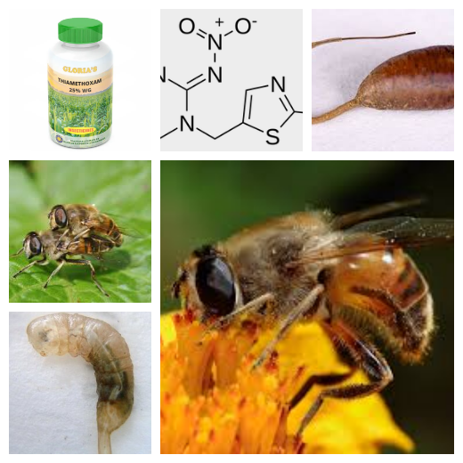
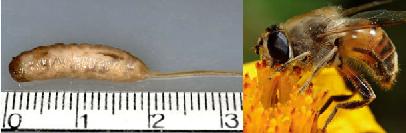

```{r libraries and importat of data, include = FALSE, echo=TRUE}

source("01_import-data.R")
library(ggplot2)
library(agricolae)
library(stringr)
library(tidyverse)
library(survival)
library(survminer)
library(dplyr)
library(tidyr)
library(ggfortify)
library(factoextra)
library(cluster)
library(corrplot)
library(ggpubr)
library(rstatix)
library(RVAideMemoire)  #if you have problems with this package, please check devtools and install_github("mixOmicsTeam/mixOmics")
library(car)

```




## 3. Introduction. Explain the origin and structure of your data.
Data comes from: https://peerj.com/articles/4258/, which is Effects of chronic exposure to thiamethoxam on larvae of the hoverfly Eristalis tenax (Diptera, Syrphidae).

The aquatic larvae of hoverfly were raised in lagoons with different concentrations of thiamethoxam. The paper studied the impact of the pesticide on larval development(weight gain), survival(whether the larva forms a pupa or not) , and seven adult behaviours.
Five-day old larvae were exposed to six concentrations of the pesticide measured in parts per billion(ppb) – 0, 5, 15, 50, 100, and 500. 
10 larval replicates per treatment
4 rounds of experiment
Total of 40 larvae were studied for each treatment. 

This resulted in 3 tables that we use as data frames: survival, behaviour, weight.

###   a.survival

 survival is a dataset with 6 columns:
<br/> 1.the ID of repetition
<br/> 2.exp_round - different blocks, with 8 repetitions
<br/> 3.treatment - Control (0),T1=5, T2= 15, T3= 50, T4= 100, T5= 500 (quantity of substance applied)
<br/> 4.daysinxp  - the amount of days it needs to reach pupae and so to be considered
survived (5 days to time it forms a pupae)
<br/> 5.time to pup - if it never reached adulthood, daysinxp are considered 0
<br/> 6.dead - mortality (yes or no) 


---

###   b.behaviour

The behaviour data records the time spent by 7 day old adult hoverflies.
Seven adult behaviours were studied for 10 minutes (600 seconds) and
the time spent on each behaviour was recorded in seconds. 
The behaviours studied are: 
</br> S- stationary
</br> GR- grooming
</br> W- walking
</br> F- flying
</br> PR- probing through the cage netting with their proboscis
</br> N- feeding on nectar, pollen, and water
</br> M- moving, which includes making small jerking motion while being stationary

<br/> 1.The blocks (1,2,3,4)
<br/> 2.Sample: a notation of the enclosed space it was studied
<br/> 3.Treatment: Control (0),T1=5, T2= 15, T3= 50, T4= 100, T5= 500 (quantity of substance applied)
<br/> 4.Sex of the insect
<br/> 5.6.7.8.9.10.11. the studied behaviours
<br/> 12.The time of study is identical for all insects: 10 minutes (600 seconds)

---

###  c.weight

<br/> 1.Rep = the block and the number of the repetition
<br/> 2.Treatment (explained before)
<br/> 3.Time (1 represents day 3, 2 day 6, 3 day 9, 4 day 12); the ones that died have measured only their last living weight
<br/> 4.FIL - Found in leaves: some insects escape and are found afterwards in the surroundings
<br/> 5.weight - in grams

---
## 4. Objectives and hypotheses.

In this project, the objectives will be to reproduce the analysis done by the team that conducted the study. Further analysis can be conducted, at the recommendation of the coordinating professor.

### OBJECTIVE TREATMENT ON SURVIVAL
Hypothesis 1:
H0: Treatments do not affect survival
H1: Treatments affect survival

Hypothesis 1': Redefine survival  and redo the analyses
H0': Treatments do not affect survival
H1': Treatments affect survival

</br>

### OBJECTIVE OF BEHAVIOUR STUDY
To study if the exposure to different concentrations of thiamethoxam during the larval stage affects the behaviour of hoverflies as adults.

Hypothesis 1:
H0: The amount of thiamethoxam hoverfly larvae are exposed to affects their behaviour as adults.
H1: The amount of thiamethoxam hoverfly larvae are exposed to does not affect their behaviour as adults.

Hypothesis 1': Relationship between larval weight and adult hoverfly behaviour.
H0: Larval weight influences adult behaviour
H1: Larval weight does not influence adult behaviour.

</br>

### OBJECTIVE OF WEIGHT DATA
-To analyse the response of larvae weights to different concentration of thiamethoxam 
-To check the effect of the treatment on the possiblity of the larvae to escape the experimental lagoon


Hypothesis:
H0: Larval weight does not depend upon the concentration of insecticide it is exposed to. 
H1: Larval weight depends upon the concentration of insecticide it is exposed to.
</br>
H0: Treatment has an effect on escaping the lagoon
H1: Treatment has no effect on escaping the lagoon

</br>

## 5. Methods. What have you done? And what did you use to do it? Step by step, so anyone could do it again by reading this part.

---

<span style="color: red;">Important note: you will find the code for the analysis like this:
<br/> survival - Task1Serban.R
<br/> weight - Task1Gabriel.R
<br/> behaviour - Task1Madhav.R and Task1Maya.R
</span>

--- 

### Methods for survival:

We plot the survival to study the effects of blocks and treatments. As we observe differences, we proceed to do a linear model  with the blocks as median. It confirms that Treatment 500 has an effect on survival. After that, we do a linear model to study the interaction between treatments and blocks. With a p_value = 0.3738 we conclude that no interaction can be proved. We proceed to find if there are any different effects of treatment on survival. 
Because the data is categorical, we use a fisher test. After a simple fisher test shows significant differences between treatments, we proceed with a multicomparison fisher test. It showed that treatment500 has significant differences with all of them, between the others there is no significant difference. 

The plot will also be ploted with Kaplan-Meier curves for a better visualisation.

Same results are obtained with the redefined survival. We redefine survival as the larvae that survived pupation and their behaviour could be studied as adults. Unfortunately, we could not correlate each individual from surival with the ones form behaviour.

---

We also did an anova for the effect of treatment on the time to pupate. The effects of the blocks and the interaction between blocks and treatment was studied. No interaction (p = 0.27), we proceed with the anova. The anova has shown significantly different effects. Furthermore, a HSD test showed two types of effects: a and b.

</br>

### Methods for weight
Initial and final weight were made into different data frames. This was needed to find weight gain of the larvae. There is a difference in the number of rows between the newly created data frames, because some larvae escaped before the final weight and some immediately after the first weight, as such, replicates having both the final and the initial weight were pulled to make a data frame. ANOVA and Kruskal-Wallis test were used to check the effect of treatment on the larval weight.  Shapiro.test was used to check normality of data. 

</br>

### Methods for behaviour:

we sourced our data from the PeerJ article mentioned above. We did Principal Component Analysis to study the impact of thiamethoxam on adult behaviour.Other methods were too complex to be explained here, detailed with plots in results.

## 6. Results. Figures and tables with captions and description of what do they mean.
</br>

#### a1. Effect of treatments on survival (multi-comp Fisher Test): 

##### treatment500 has significant differences with all of them, between the others there is no significant difference

```{r effect of treatments on survival, fig.cap = "Figure a1: Plot to see the differences between blocks and treatments of the survival of Eristalis tenax larvae when reared in substrate contaminated with five different concentrations of thiamethoxam, plus control.", echo=TRUE}
#Step 1: We plot it in order to see if:
#-there are differences between the blocks
#-there are differences between the treatments

survival <- surv

survival$treatment <- as.factor(survival$treatment)
survival$exp_round <- as.factor(survival$exp_round)
ggplot(survival, aes(x=treatment, y=dead, fill=exp_round)) + 
  geom_bar(stat="identity")

#It is obvious that the treatment500 is different from the others.
#It is hard to observe if there are differences between blocks, we proced to do a linear model with the blocks as median

lm1 <- lm(dead ~ treatment + exp_round, data= survival)
#summary(lm1)

#P value is smaller than 0.05 for: treatment500. The other treatments and the blocks show a p_value smaller than 0.5 so no significant effect.
#We proceed to study the interaction betwenn treatments and blocks.

lm1 <- lm(dead ~ treatment + exp_round +
            I(as.numeric(treatment) * as.numeric(exp_round)),
          data= survival)
#summary(lm1)

#No interaction between treatments and blocks. (p_value = 0.3738)
#We proceed with the fisher test, as the data is categorical.

t1 <- table(survival$treatment, survival$dead)
#fisher.test(t1, simulate.p.value=TRUE)

#A simple fisher test tells us that there are significant differences between treatments.
#We proceed with a multi-comparison fisher test.
```

#### Multi-comparison fisher test, each treatment compared with the control

```{r 2-effect of treatments on survival, echo=TRUE}
f1 <- fisher.multcomp(t1)
knitr::kable(f1$p.value[,1], align = 'ccccc', format='simple', caption = "Table that shows pvalue for the mult-fisher test, each treatment being comaperd with control")

```


Treatment 500 has significant differences with the control, others show no significant difference (p value smaller than 0.05) 
</br> </br>

#### a2. Effect of treatments on  REDEFINED survival (multcomp Fisher Test): Treatment500 has significant differences with all of them, between the others there is no significant difference

```{r effect of treatments on REDEFINED survival,fig.cap = "Figure a2.1: The differences between blocks and treatments on REDEFINED survival for Eristalis tenax larvae when reared in substrate contaminated with five different concentrations of thiamethoxam, plus control.", error=FALSE, echo=TRUE}
#Redefine survival and redo the analyses

#Step 1:  Redefine dead
#We get the data from behaviour in order to redefine survival. In order to do this, we create survival2, a data frame with the insects that survived.

numextract <- function(string){
  str_extract(string, "\\-*\\d+\\.*\\d*")
}
behaviour <- beha
ID <- numextract(behaviour$sample)
survival2 <- data.frame(ID, behaviour$exp_round, behaviour$treatment)

names(survival2)[names(survival2) == "ID"] <- "RepID"
names(survival2)[names(survival2) == "behaviour.exp_round"] <- "exp_round"
names(survival2)[names(survival2) == "behaviour.treatment"] <- "treatment"

#Step 2: We observed that we can not corelate the data from behaviour with the one from survival, as the notations changed (we have sample 29 for exp_round 1)
#We find a work around: merge the data with the survival one, but deleting the days in exp and time to pupate, as those can not be corelated. We just keep the number of individuals that survived and the number of individual that were initially in the experience.

survival <- surv
survival[4:5] <- list(NULL)

redefdead <- replicate(213, 1)
survival <- data.frame(survival, redefdead)

i <- 1
j<- 1

for(i in 1:nrow(survival)){
  while(survival$treatment[i] == survival2$treatment[j] && 
        survival$exp_round[i] == survival2$exp_round[j] && j < nrow(survival2)){
    survival$redefdead[i] <- 0
    j<- j+1
    i <- i+1
  }}

#Step 1: We plot it in order to see if:
#-there are differences between the blocks
#-there are differences between the treatments


survival$treatment <- as.factor(survival$treatment)
survival$exp_round <- as.factor(survival$exp_round)
ggplot(survival, aes(x=treatment, y=redefdead, fill=exp_round)) + 
  geom_bar(stat="identity")

#It is obvious that the treatment500 is different from the others.
#It is hard to observe if there are differences between blocks, we proced to do a linear model with the blocks as median 

lm1 <- lm(redefdead ~ treatment + exp_round, data= survival)
#summary(lm1)

#P value is smaller than 0.05 for: treatment500. The other treatments and the blocks show a p_value smaller than 0.5 so no significant effect.
#We proceed to study the interaction betwenn treatments and blocks.

lm1 <- lm(redefdead ~ treatment + exp_round +
            I(as.numeric(treatment) * as.numeric(exp_round)),
          data= survival)
#summary(lm1)

#No interaction between treatments and blocks. (p_value = 0.1551)
#We proceed with the fisher test, as the data is categorical.

t1 <- table(survival$treatment, survival$redefdead)
#fisher.test(t1, simulate.p.value=TRUE)

#A simple fisher test tells us that there are significant differences between treatments.
#We proceed with a multi-comparison fisher test.
```

#### Multi-comparation fisher test, each treatment compared with the control

```{r 2-effect of treatments on REDEFINED survival, error=FALSE, echo=TRUE}
f1 <- fisher.multcomp(t1)
knitr::kable(f1$p.value[,1],cap = "This table shows the multi-comparison fisher test, each treatment compared with the control for REDEFINED survival")


```
</br>
Treatment 500 has significant differences with the control, others show no significant difference (p value smaller than 0.05)
</br> </br>

#### a3. A plot that puts survival and pupating in perspective (Kaplan-Meier curves)

```{r Kaplan-Meier curves, fig.cap = "Figure a3.1.  Cumulative survival of Eristalis tenax larvae when reared in substrate contaminated with five different concentrations of thiamethoxam, plus control." , error=FALSE, echo=TRUE}


survival <- surv

#we create the surv_object, which is a compiled version of the daysinexp and dead columns that can be interpreted using the survfit function
 
surv_object <- Surv(time = survival$daysinexp, event = survival$dead)

#Now we do the Kaplan-Meier curves
 
fit1 <- survfit(surv_object ~ treatment, data = survival)
#summary(fit1)
#We plot the Kaplan-Meier curves so we can see better
ggsurvplot(fit1, data = survival, pval = TRUE)


```

</br>

#### a4. Effect of treatments on time to pupate (ANOVA): Treatment 500 is the only one that shows significant differences 
#PLOT

</br>

```{r Effect of treatments on time to pupate (ANOVA), fig.cap="Figure a4.1: Time to pupate of Eristalis tenax larvae when reared in substrate contaminated with five different concentrations of thiamethoxam, plus control.", error=FALSE, echo=TRUE}

#Part 2 - Analysis on time to pupate on the original defined survival, as for the redefined we weren't able to identify the individuals

#Now we do the same with time to pupate. We found it already hard to read, because of the numerous treatments so we decided to include the time to pupate in another ggplot.
surv_object <- Surv(time = survival$timetopup, event = survival$dead)
fit2 <- survfit(surv_object ~ treatment, data = survival)
#summary(fit2)
ggsurvplot(fit2, data = survival, main = "survival for pupate", pval = TRUE)

#As many insects die while on treatment 500, the plot for time to pupate is not very conclusive.

#ANOVA

survival <- surv
#plot(y=survival$timetopup, x= survival$treatment, xlab="Time to pupate" , ylab="Treatment")

#We know from previous analysis that treatment 500 is different. We proceed to study the differences between blocks and treatments for the time to pupate

lm1 <- lm(timetopup ~ treatment + exp_round, data= survival)
#summary(lm1)

#P value is bigger than 0.05 for: treatment500. The other treatments and the blocks show a p_value smaller than 0.5 so no significant effect.
#We proceed to study the interaction betwenn treatments and blocks.

lm1 <- lm(timetopup ~ treatment + exp_round +
            I(as.numeric(treatment) * as.numeric(exp_round)),
          data= survival)
#summary(lm1)

#No interaction, p = 0.27, do the anova

anv <- aov( lm(survival$timetopup ~ survival$treatment) )
#summary(anv)
```
</br>

#### a5. Effect of treatments on survival (ANOVA): Treatment 500 is the only one that shows significant differences
#PLOT

```{r HSD Test for survival, fig.cap="Figure a5. HSD test that studies the effect of treatment on survival for of Eristalis tenax larvae when reared in substrate contaminated with five different concentrations of thiamethoxam, plus control.", error=FALSE, echo=TRUE}

#Anova shows significant differences between treatments. We proceed with a HSD test.

agri <- HSD.test(anv, 'survival$treatment', alpha = 0.05, group=TRUE, main = "HSD Test")
plot(agri, main = "Effect of treatment on survival", ylab = "Insects counted", xlab = "Type of spray", sub = "two groups of effects: a and b")

#Conclusion:
#Treatment 500 is the only one that shows significant differences in comparison with the control.


```
</br>
Conclusions:
Treatment 500 is the only one that shows significant differences in comparison with the control. </br> </br>


### b. Effects of treatments on behaviour


#### b1. Organizing the data. 
We had to convert our data from the tibble format to a numeric dataframe. 
```{r, error=FALSE}
behaviour1 <- beha  ## making a copy of the originaml dataframe
behaviour1 <- as.data.frame(behaviour1)
row.names(behaviour1) <- paste(behaviour1$sample,
                               behaviour1$exp_round, sep = "_")
b1 <-select(behaviour1, S:M)
b2 <- data.frame(as.factor(beha$treatment), b1)
colnames(b2)[colnames(b2) == "as.factor.beha.treatment."] <- "treatment"

```

</br>

#### b2. Principal Component Analysis

We ran the prcomp command to run a PCA on our dataframe. 
```{r, fig.cap = "Figure b2.1: From the Eigen values and the Scree plot of our PCA we understand that Principal Component 1 and Principal Component 2 explain 46.4% of the variance in the data.", error=FALSE}
pca1 <- prcomp(b1, scale = TRUE)

##Eigen values
eig.val <- get_eigenvalue(pca1)

##Scree plot
fviz_eig(pca1, addlabels = TRUE)
```

</br>


##### Heat mapping
###### The heat map explains shows which behaviour is best explained by which Principal Component.
```{r, fig.cap = "Figure b2.2: Heat map for behaviour. It is a tool that enables us to visualize the dimensions that best explain variance in each behaviour. Key : S - stationary, GR - grooming, W - walking, F - flying, PR - probing, N - feeding(nutrition), M - moving", error=FALSE}


var <- get_pca_var(pca1)

autoplot(var$cor, main = "Heat map")
```
From the heat map we can visualize that the first two dimensions explain the largest degree of variance in our data. The third and fourth component also explain a large degree of the variance. The fourth dimension is a good fit for the probing behaviour (PR). 

</br>

##### Correlation circle
```{r, fig.cap = "Figure b2.3: This plot of the correlation circle visualizes the correlation between the first two principal components which explain the highest variance which are respectively 27.6 % and 18.8%. We can conclude that Flying and walking are correlated together (the arrow are grouped), stationary and  grooming are correlated together and the arrows which reprents feeding on nectar, pollen, and water is in the opposite direction and not correlated with others behaviours. Key : S - stationary, GR - grooming, W - walking, F - flying, PR - probing, N - feeding(nutrition), M - moving", error=FALSE,warning=FALSE}
fviz_pca_var(pca1, col.var = "black")
```

</br>

##### Individuals PCA

```{r, fig.cap = "Figure b2.4: This plot with ellipses shows the distribution of each behaviour following each treatment. From this plot we can conclude that there is no significant difference between the effect of treatment on different behaviours because the ellipses overlap, Key : S - stationary, GR - grooming, W - walking, F - flying, PR - probing, N - feeding(nutrition), M - moving. Treatments are measured in parts per billion(ppb).", error=FALSE,warning=FALSE}
autoplot(pca1, data = b2, colour = 'treatment', frame = TRUE, frame.type = 'norm')
```

</br>

#### b3. Shapiro Wilk and Kruskal Wallis to study the effect of treatment on behaviour

```{r}
beh.aovS <- aov(S ~ treatment, data = b2)
beh.aovGR<- aov(GR ~ treatment, data = b2)
beh.aovW <- aov(W ~ treatment, data = b2)
beh.aovF <- aov(F ~ treatment, data = b2)
beh.aovPR <- aov(PR ~ treatment, data = b2)
beh.aovN <- aov(N ~ treatment, data = b2)
beh.aovM <- aov(M ~ treatment, data = b2)
```

</br>

##### Test for normality using Shapiro Wilk test

</br>

###### The p values for stationary, grooming, walking, flying, probing, feeding, moving respectively.
```{r}
SS <- shapiro.test(beh.aovS$residuals)
SSp <- SS[["p.value"]]
SGR <- shapiro.test(beh.aovGR$residuals)
SGRp <- SGR[["p.value"]]
SW <- shapiro.test(beh.aovW$residuals)
SWp <- SW[["p.value"]]
SF <- shapiro.test(beh.aovF$residuals)
SFp <- SF[["p.value"]]
SPR <- shapiro.test(beh.aovPR$residuals)
SPRp <- SPR[["p.value"]]
SN <- shapiro.test(beh.aovN$residuals)
SNp <- SN[["p.value"]]
SM <- shapiro.test(beh.aovM$residuals)
SMp <- SM[["p.value"]]

```

Stationary p value =`r SSp` </br>
Grooming p value =`r SGRp` </br>
Walking p value =`r SWp` </br>
Flying p value =`r SFp` </br>
Probing p value =`r SPRp` </br>
Feeding p value =`r SNp` </br>
Moving p value =`r SMp` </br>

###### Distribution is not normal.

</br>

##### Kruskal Wallis test

```{r}
krusS <- kruskal(b2$S, trt = b2$treatment, alpha = 0.05)
knitr::kable(krusS$groups, align='ccccccc', format = "simple", caption =  "Kruskal-Wallis groups for stationary behaviour")

krusGR <- kruskal(b2$GR, trt = b2$treatment, alpha = 0.05)
knitr::kable(krusGR$groups, align='ccccccc', format = "simple", caption =  "Kruskal-Wallis groups for grooming behaviour")

krusW <- kruskal(b2$W, trt = b2$treatment, alpha = 0.05)
knitr::kable(krusW$groups, align='ccccccc', format = "simple", caption =  "Kruskal-Wallis groups for walking behaviour")

krusF <- kruskal(b2$F, trt = b2$treatment, alpha = 0.05)
knitr::kable(krusF$groups, align='ccccccc', format = "simple", caption =  "Kruskal-Wallis groups for flying behaviour")

krusPR <- kruskal(b2$PR, trt = b2$treatment, alpha = 0.05)
knitr::kable(krusPR$groups, align='ccccccc', format = "simple", caption =  "Kruskal-Wallis groups for probing behaviour")

krusN <- kruskal(b2$N, trt = b2$treatment, alpha = 0.05)
knitr::kable(krusN$groups, align='ccccccc', format = "simple", caption =  "Kruskal-Wallis groups for feeding(nutrition) behaviour")

krusM <- kruskal(b2$M, trt = b2$treatment, alpha = 0.05)
knitr::kable(krusM$groups, align='ccccccc', format = "simple", caption =  "Kruskal-Wallis groups for moving behaviour")

```


###### From the Kruskal Wallis test we can see that
###### 1. For Walking, Flying, Probing behaviours treatment did not have any effect on the amount of time spent by the adult hoverfly practicing each behaviour.
###### In the rest of the behaviours, the time  spent in each behaviour was different but there is no pattern in their classification. For example, in Moving behaviour, the control adults and the adults exposed to 500 ppb of thiamethoxam are grouped together.

#### b4. Is there a relationship between weight and behaviour?

###### It was not possible to identify the same individuals in both the weight and behaviour dataset. So we took the average weight for each treatment and the average time spent by each treatment group for each behaviour. Note that the average weight for each behaviour is similar. We combined this data into a single dataframe and made a barplot to visualize the result.

###### However, this comparison is not perfect. There was weight data for 145 individuals from which we got our average weights. However only 117 individuals were observed for behaviour.
###### It is possible that some of the larva that formed pupa did not emerge as adult hoverflies and so their behaviour was not recorded.

```{r, fig.cap = "Figure b4.1: Relationship between average weight for each treatment and average time spent for each behaviour, Key : AvgS - average time spent being stationary, AvgGR - Average time spent grooming, AvgW - Average time spent walking, AvgF - Average time spent flying, AvgPR - Average time spent probing, AvgN - Average time spent feeding(nutrition), AvgM - Average time spent moving. Treatments are measured in parts per billion(ppb) and time is measured in seconds.", error=FALSE,warning=FALSE}

Weight1 <- filter(weig, FIL == 0, Time == 4)
AvgWeights <- as.numeric()
for(i in levels(as.factor(Weight1$Treatment))){
   AvgWeights <-c(AvgWeights,mean(Weight1$weight[which(Weight1$Treatment == i)]))
}

##Calculating the average time spent by adults of each treatment group
##For each behavious

##Avg S
AvgS <- as.numeric()
for(i in levels(as.factor(behaviour1$treatment))){
  AvgS <- c(AvgS, mean(behaviour1$S[which(behaviour1$treatment == i)]))
}


##Avg GR
AvgGR <- as.numeric()
for(i in levels(as.factor(behaviour1$treatment))){
  AvgGR <- c(AvgGR, mean(behaviour1$GR[which(behaviour1$treatment == i)]))
}


##Avg W
AvgW <- as.numeric()
for(i in levels(as.factor(behaviour1$treatment))){
  AvgW <- c(AvgW, mean(behaviour1$W[which(behaviour1$treatment == i)]))
}


##Avg F
AvgF <- as.numeric()
for(i in levels(as.factor(behaviour1$treatment))){
  AvgF <- c(AvgF, mean(behaviour1$F[which(behaviour1$treatment == i)]))
}


##Avg PR
AvgPR <- as.numeric()
for(i in levels(as.factor(behaviour1$treatment))){
  AvgPR <- c(AvgPR, mean(behaviour1$PR[which(behaviour1$treatment == i)]))
}


##Avg N
AvgN <- as.numeric()
for(i in levels(as.factor(behaviour1$treatment))){
  AvgN <- c(AvgN, mean(behaviour1$N[which(behaviour1$treatment == i)]))
}


##Avg M
AvgM <- as.numeric()
for(i in levels(as.factor(behaviour1$treatment))){
  AvgM <- c(AvgM, mean(behaviour1$M[which(behaviour1$treatment == i)]))
}

Treatments <- c(0, 5, 15, 50, 100, 500)
WeiBeha <- data.frame(Treatments, AvgWeights, AvgS, AvgGR, AvgW, AvgF, AvgPR, AvgN, AvgM)
knitr::kable(WeiBeha, format = "simple", caption = "Average time spent for each behaviour  for different treatments and corresponding  weights")

WeiBeha2 <- WeiBeha %>%
  pivot_longer(!c(Treatments,AvgWeights), names_to = "Behaviour", values_to = "seconds")

WeiBeha2$Treatments <- as.factor(WeiBeha2$Treatments)
G1 <- ggplot(data=WeiBeha2, aes(x= Treatments, y=seconds, fill = Behaviour)) +
  geom_bar(stat="identity", position=position_dodge())+
  ggtitle("Relationship between weight and behaviour")

G1 + scale_x_discrete(labels=c("0" = "0 (0.327g)", "5" = "5 (0.324g)",
                              "15" = "15 (0.324g)", "50" = "50 (0.327g)",
                              "100" = "100 (0.319g)", "500" = "500 (0.312g)"))

```

</br>

### C.  Weight Analysis

##### Before the main analysis was carried out, several adjusments were made on the data. A new data.frame was created to compute the needed parameters. It was discovered that during the experiment, some lavae escaped the treatment site, and as such made it impossible to obtain their final weight. We therefore pulled together those lavae having the initial and final data. Difference was obtained between their initial and the final weight and this was used for the analysis.
```{r}
lavalweight <- weig
View(lavalweight)

# Make new data.frames from lavalweight for the initial and final time (1&4) for optimum analysis

Initialwgt <- filter(lavalweight, Time == 1)
Finalwgt <- filter(lavalweight, Time == 4)

#Find the difference between the final and initial weight. There is a difference in the number of row between the newly created data.frames, because some lavae escaped before the final weight and some immediately after the first weight, so there is a need to get those replications that have both the final and the initial weight to get the difference in weight.

Fordifference <- filter(lavalweight, Time == 4)


Initialweight <- replicate(153, 0)
Fordifference <- data.frame(Fordifference, Initialweight)

for(i in 1:nrow(Fordifference)){
  for(j in 1:nrow(Initialwgt)){
  if(Fordifference$Rep[i] == Initialwgt$Rep[j]){
    Fordifference$Initialweight[i] <- Initialwgt$weight[j]
  }}}

#Change the column names in the data.frame: weight to final weight to differentiate between initial and final weight.

colnames(Fordifference)[colnames(Fordifference) == "weight"] <-"Finalweight"
colnames(Fordifference)[colnames(Fordifference) == "Rep"] <- "RepID"

##Create another column for difference between final and initial weight
Fordifference$Difference <- (Fordifference$Finalweight - Fordifference$Initialweight)

##Remove the column time from the data.frame
Fordifference <-  select(Fordifference, -Time)

##Arrange the column of the data.frame in the order below
Fordifference <- Fordifference[c("RepID", "Treatment", "FIL", "Initialweight", "Finalweight", "Difference")]

## The treatment, FIL and Time were integer, so i needed to convert them to a factor for easier manipulation.
Fordifference$Treatment <- as.factor(Fordifference$Treatment)
Fordifference$FIL <- as.factor(Fordifference$FIL)


```

#### c1:  P.value for Shapiro test after the ANOVA and visual representation of the analysis
```{r echo=TRUE}
res.aov<- aov(Difference ~ Treatment, data = Fordifference)

rs <- shapiro.test(res.aov$residuals)
ra <- (rs[["p.value"]])

```
Shapiro-Wilk test p value =`r ra` </br>

```{r, fig.cap= "Figure c1:Distribution shape of the data", echo=TRUE}
ggdensity(res.aov$residuals, fill = "lightgray")
```

```{r, fig.cap= "Figure c2:Normal Q-Q plot",echo=TRUE}
qqnorm(res.aov$residuals)
qqline(res.aov$residuals)
```


###### Based on the result of the Shapiro-Wilk test, we can infer that the distribution of the weight data does not assume a normal distribution. Therefore, there is a need to test the data using a different test which could contain a not normally distributed data

</br>

#### c2: Kruskal-Wallis  analysis and Visual representation of the analysis
```{r fig.cap= "Figure c3:Comparison of treatment effect on larval weight", echo=TRUE, warning=FALSE}
kruz <- kruskal(Fordifference$Difference, trt = Fordifference$Treatment)
knitr::kable(kruz$groups, align='ccccccc', format = "simple", caption =  "Kruskal-Wallis groups for weight difference")


##Make a plot for visual representation of the analysis and comparison between treatments and control
my_comparisons <- list(c("0", "5"), c("0", "15"),c("0", "50"),c("0", "100"),
                       c("0", "500"))


Fordifference %>%
  ggplot(aes(x = Treatment, group = Treatment, y = Difference, color = Treatment)) +
  geom_violin(trim = F, width = 0.65, draw_quantiles = c(0.25, 0.5, 0.75)) +
  theme_classic()+
  scale_y_continuous(limits = c(0.15, 0.70)) +
  xlab("Treatment") + 
  ylab("Weight")+
  stat_compare_means(method = "kruskal.test")+
  stat_compare_means(comparisons = my_comparisons,label.y = c(0.43,0.46,0.49,0.52,0.55))+
  stat_compare_means(label.y = 70)

```
</br>


###### Based on the Kruskal Wallis test, there is no significant difference between treatments

</br>

#### c3: Fisher's exact test and fisher multcomp test between between FIL and the treatment. Done to determine if there are significant difference between treatments and FIL
```{r echo=TRUE}
ff <- table(Fordifference$FIL, Fordifference$Treatment)
ff1 <- fisher.test(ff)
Fp <- ff1[["p.value"]]
```
Fisher test p value =`r Fp` </br>

#### Based on the fisher's test (i.e p.value = 0.3198), it can be concluded that the treatment had no effect on the larvae escaping the lagoon

```{r echo=TRUE}
ff2 <- fisher.multcomp(ff)

knitr::kable(ff2$p.value[1,], caption = "Table that shows pvalue for the fisher-multcomp test, each treatment being comaperd with control")
```

</br>

## 7. Discussion
Our analysis results are in agreement with the author's.

The redefinition of survival led to the same results as the initial survival.

We consider that the Kaplan-Meier curves would be better represented if the survival and time to pupate would be separated in the graphical representation.

To summarize, we reproduced the study successfully, did additional tests, and got the same results.


</br>

## 8. Conclusion

**Place for improvement for the authors: **
</br> -impossible to track individuals between data sets (inconsistent labeling with no legends)
</br> -more analysis could be done by the original authors: redefine survival, Principal Component Analysis for behaviour)
</br> -the data sets notation is not clearly explained(a lot of time was spent to understand what FIL means, we are almost sure that it means Found In Leaves)
</br> -they never responded to our questions about the study on the peerj platform

**However, we strongly appreciate the author's work:**
</br> -the theme is very relevant, supporting sustainability and biodiversity (looking at a minor pollinator)
</br> -simple and easily understandable made it an ideal for studying

**We also appreciate the complex experimental design: **
</br> -they found a place with no history of insecticide use 
</br> -including eggs were collected from different females to account for genetic variation with respect to thiamethoxam tolerance (in different experience round)
</br> -elaborate measures to simulate natural environment

**We have advanced a lot**
</br> -github in a team and how to correct its' errors
</br> -teamwork in general
</br> -countless new R and statistical practical and theoretical knowledge: Kaplan-Meier curves, how to transform the data, how to study and analyze categorical data
PCA: elipses, Heatmap , Correlation circle

</br> We practically used what we learned in the class: ANOVA, Shapiro, Kruskal-Wallis,ggplot function, Fisher Test and stat compare mean

**We still have a lot to learn:**
</br> -syntax to be learned
</br> -a lot of statistical tests, tools and graphical representations to be discovered by each one
</br>- how to come up with ideas for our own research
</br>- how to organize our own research and the collected data
</br>- how to deal with larger data sets (for this project it was small)
</br>- because of the poor quality of the data notations between the different data sets(survival, weight, behaviour) we could not do additional analysis like mediation and moderation and that is something we would have liked to practice
</br> -how to make more visually pleasing Rmarkdown documents
